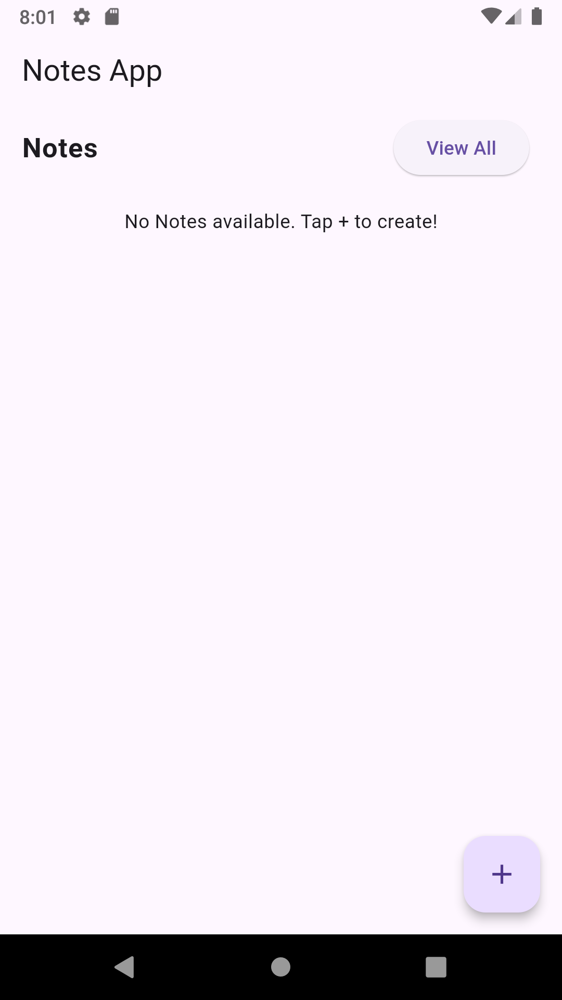
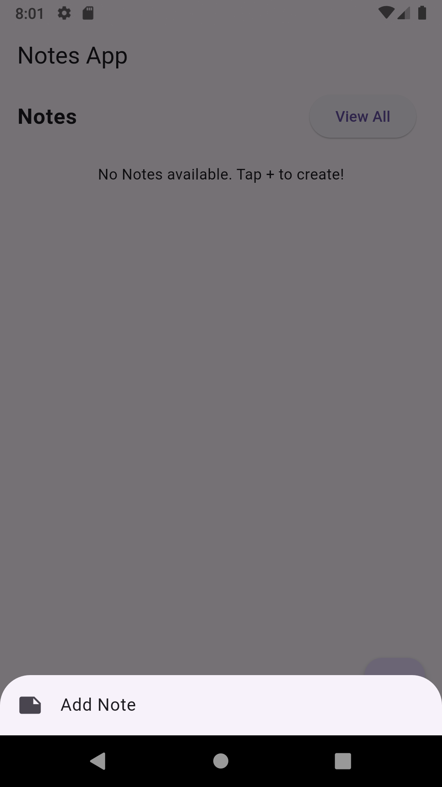
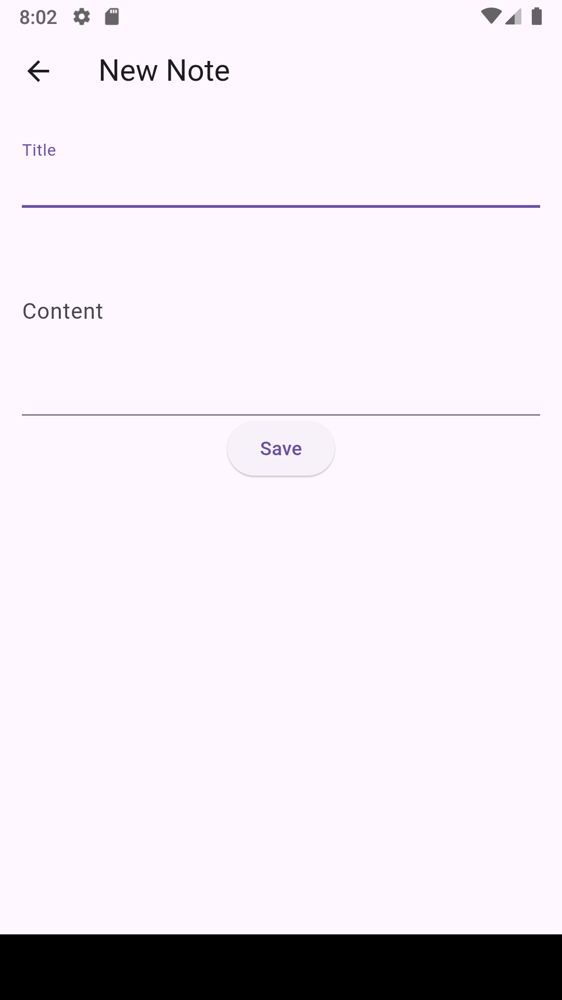
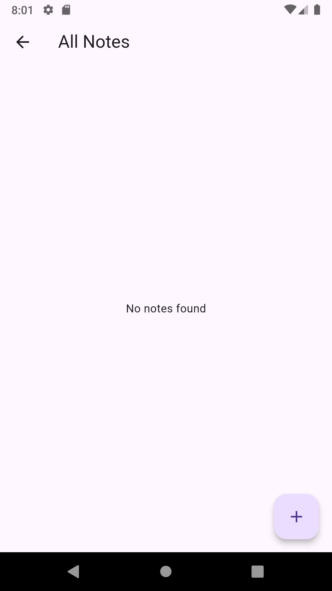
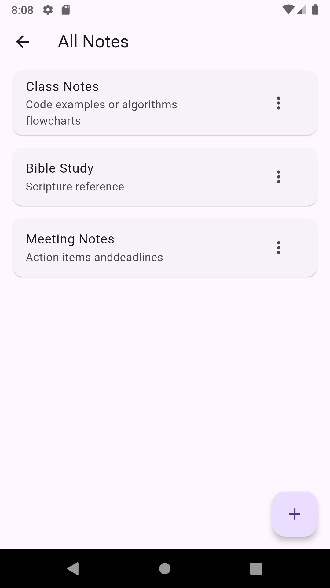

# 📝 notes_app

A lightweight and user-friendly notes application built with Flutter.  
Easily create, edit, and manage your notes in a clean and intuitive interface — optimized for productivity and simplicity.

---

## 📸 App Screenshots

### 🏠 Home Screen  
A simple dashboard to access and manage all your notes.

---

### ➕ Add Note  
Quickly create a new note with just a tap.

---

### ✍️ Create Note Screen  
Write your thoughts or tasks with a smooth, focused writing interface.

---

### 📭 All Notes Screen (Empty State)  
When no notes are added — clean and minimal.

---

### 📋 All Notes Screen (With Notes)  
Browse your saved notes in a structured view.

